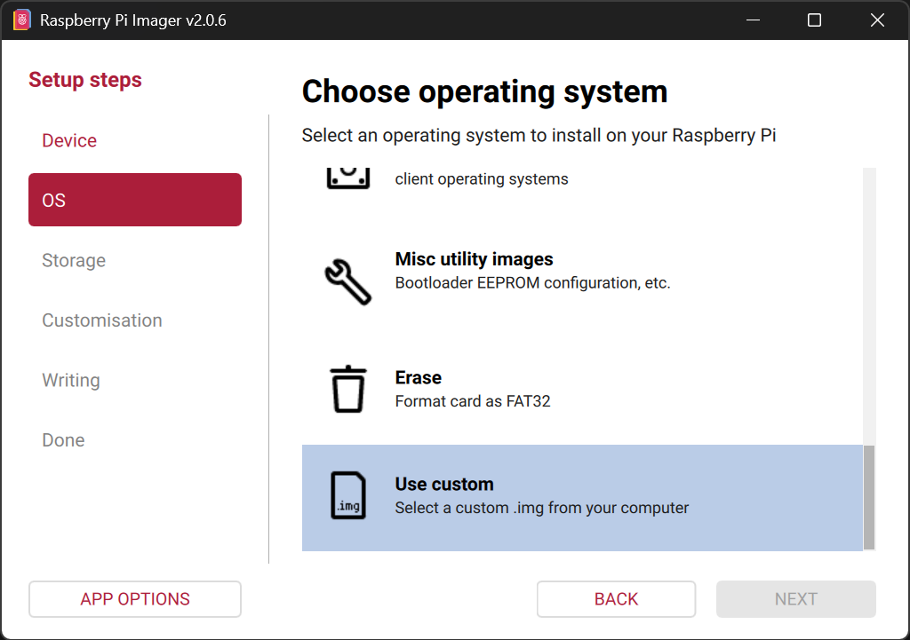
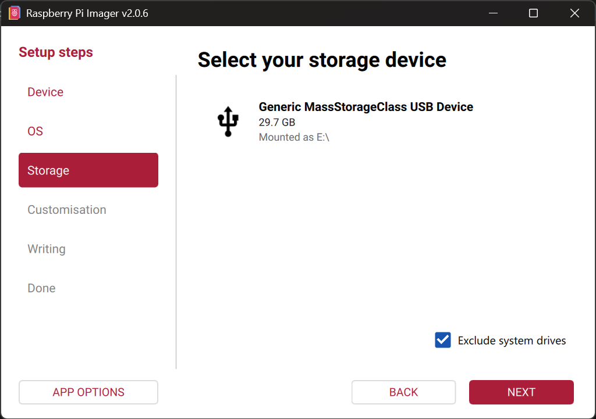
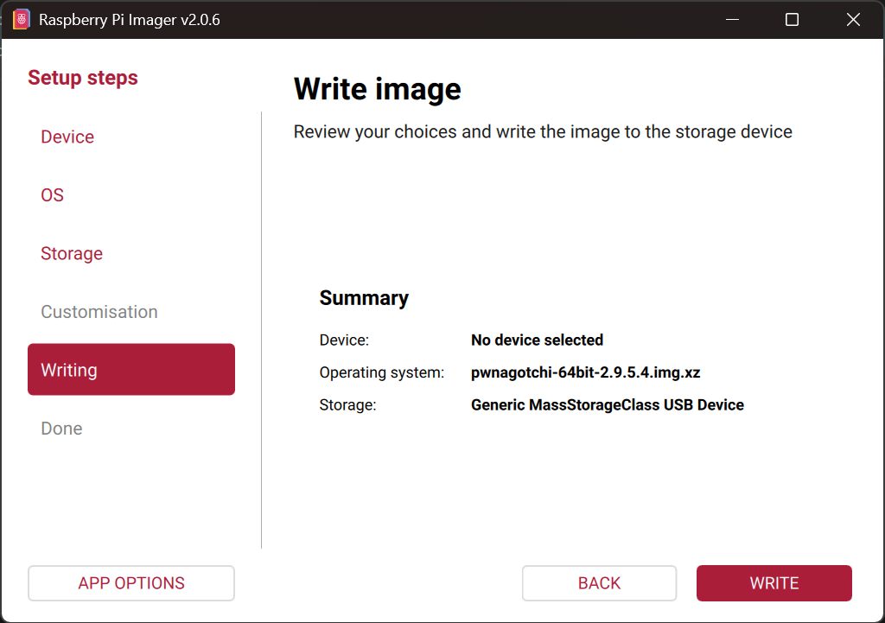
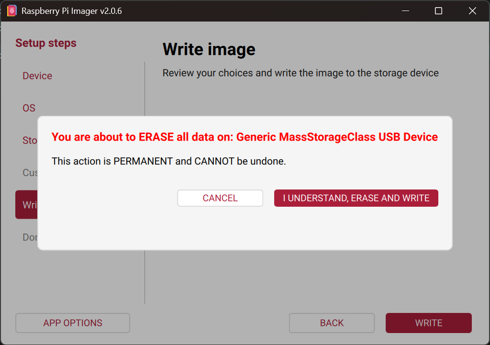
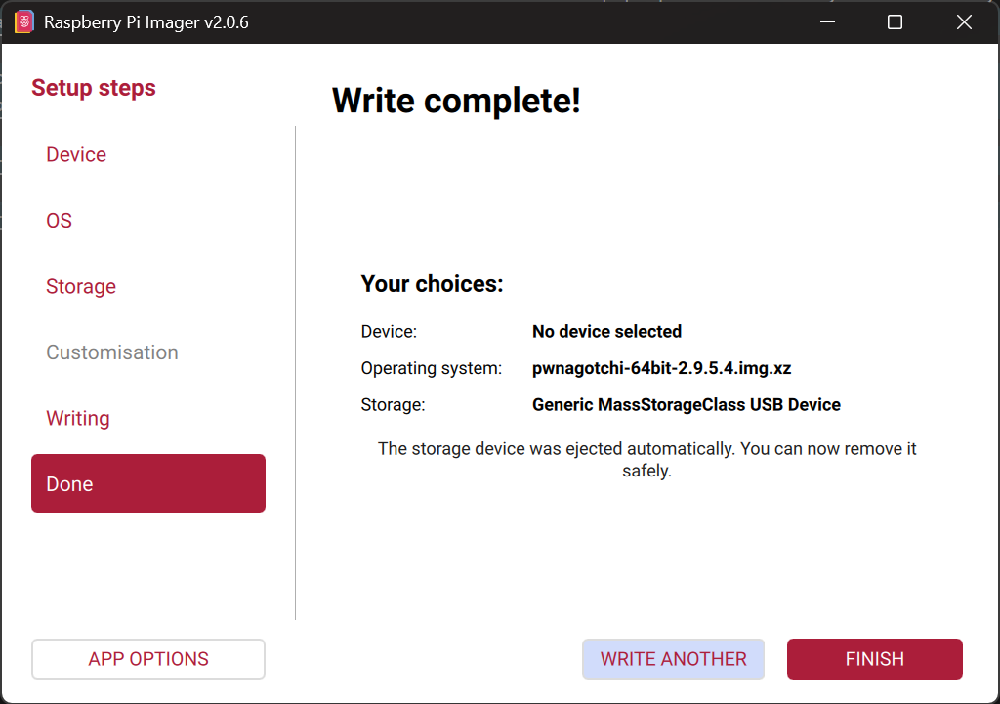
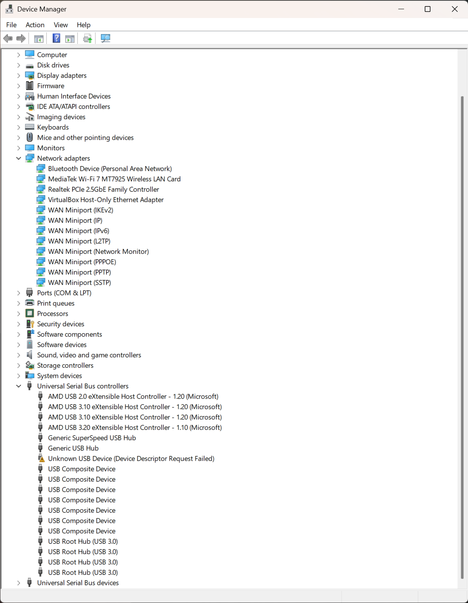
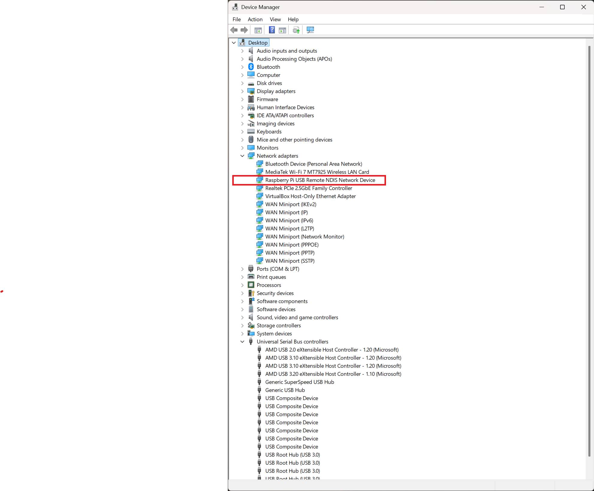
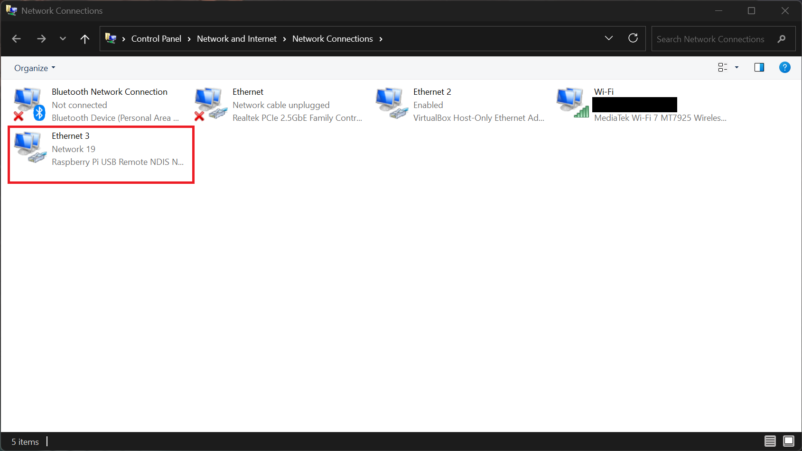
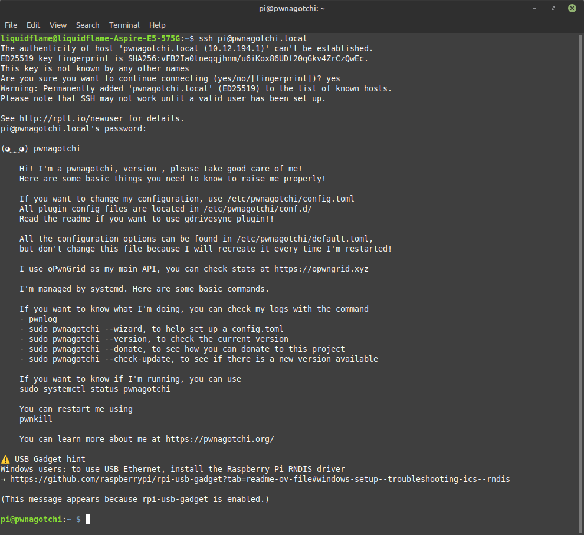

# Recommended Components
---
- [Raspberry Pi Zero 2 WH](https://amzn.to/3ZwpadZ)
- [32GB microSDHC Class 10 ](https://amzn.to/4rho8Pb)
- [USB-A to Micro USB Data Cable](https://amzn.to/4rSRDH4)
- [Waveshare V4](https://amzn.to/4awppL9)
- [PiSugar 3](https://amzn.to/407Rfs8)

# Flashing the Image
- If you're using a Raspberry Pi 0W use the 32-bit image and if you are using a Raspberry Pi 02W, use the 64-bit image of [jayofelony/pwnagotchi](https://github.com/jayofelony/pwnagotchi/releases/latest)
- Once you have your image download, use the [Raspberry Pi Imager](https://www.raspberrypi.com/software/) to flash the software.
  - On the left hand side select **OS** and then scroll down to the bottom and select **Use custom**. This will pop-up a window for you to select your downloaded image.

  - Once you have your image selected, click **NEXT*
  - Choose your microSDHC card for the storage device and click **NEXT**

  - Click the **WRITE* button

  - Click the **I UNDERSTAND, ERASE AND WRITE** button 

  - Click the **FINISH** button and then safely eject your microSDHC card


# Linux Setup
---


# Windows Setup
---
## Install RNDIS Driver
Before connecting the Pwnagotchi to your computer, you need to install the [RNDIS driver](https://github.com/jayofelony/pwnagotchi/wiki/rpi-usb-gadget-driver-setup.exe) in order for Windows to recognize your Pwnagotchi as a valid network device. Once installed, RNDIS creates a virtual network card that lets your computer treat the USB cable exactly like an Ethernet cable.

## Connecting the Pwnagotchi
- Open Device Manager and Network Connections, this will make it easier to know when the Pwnagotchi has connected to our computer and is ready to communicate.
- Plug the USB-A to Micro USB data cable into the micro usb port closet to the HDMI port. Once you do this you will see in your Device Manager, **Unknown USB Device (Device Descriptor Request Failed)** under Universal Serial Bus controllers.

- **⚠️ CRITICAL STEP:** Leave the Pwnagotchi alone for 10 minutes. It's going to look like nothing is happening, and the Waveshare screen may flash and restart, but the Pwnagotchi takes awhile for it to initially setup and connect to the computer. I'm not joking, go get a drink, browse your phone, whatever just leave the Pwnagotchi alone.
  - During this time, the Pwnagotchi is generating its RSA cryptographic keys. This requires 'entropy' (randomness), and since the Pi Zero is small, it takes a while to gather enough random data to create secure keys. If you unplug it now, you might end up with half-generated keys or a corrupted file system.
- Once the Pwnagotchi is done setting up, the **Unknown USB Device (Device Descriptor Request Failed)** under Universal Serial Bus controllers will disappear and you should then see a new **Raspberry Pi USB Remote NDIS Network Device** under Network adapters.

- You should also see a new network connection.

- Now you can SSH into the Pwnagotchi to configure it.
  - Using your preferred terminal, type ```ssh pi@pwnagotchi.local```
  - Confirm the security message by typing ```yes```, and then enter the default password ```raspberry```

  - Now you should be connected to the Pwnagotchi and can continue onto configuring it.

# Configuring the Pwnagotchi
