This innocent looking little fella is actually quite mischievous. Let me introduce you to the Pwnagotchi. The Pwnagotchi is an open-source project designed to capture WPA/WPA2 handshakes from surrounding Wi-Fi networks. In short the Pwnagotchi is able to trick your devices into thinking they’ve been kicked off the Wi-Fi. When your device automatically scrambles to reconnect, the Pwnagotchi is waiting to record the 'secret handshake' they use to get back in.

# The Vulnerability
---
The Pwnagotchi exploits two fundamental flaws in how older Wi-Fi protocols (specifically WPA/WPA2) work. In standard WPA2, the data you send (emails, passwords) is encrypted. However, the "management frames" that keep the network running—like the signals that say "I'm here," "Connect to me," or "Disconnect now"—are not encrypted or authenticated.

Because management frames aren't secure, the Pwnagotchi can pretend to be the Router. It sends a "De-authentication" packet to a connected device (like your phone). It effectively says: "Hey, this is the Router. I need you to disconnect immediately." Your phone, obeying the protocol, says "Okay!" and drops the Wi-Fi connection. When your phone realizes it was disconnected, it immediately tries to reconnect to the Wi-Fi.

To do this, it has to prove it knows the password without actually sending the password in plain text. It performs a 4-Way Handshake. The Pwnagotchi waits for that moment of reconnection and records the Handshake between your phone and the router. This handshake contains a hash derived from the real password.

# The Real Danger
---
The Pwnagotchi itself is a weak computer; it can't crack the password—it just collects the handshakes. The attacker downloads the handshakes and then is able to perform a Dictionary Attack, generating millions of passwords per second, turning them into hashes, and checking if they match the ones the Pwnagotchi took. If your password is weak (e.g., "Summer2024"), it will be cracked in seconds. If it is strong (e.g., "Pw1j%SLE5#aVm@sRvCJ3"), the Pwnagotchi's capture is useless.

# Let's Build One
---
## Recommended Components
- [Raspberry Pi Zero 2 WH](https://amzn.to/3ZwpadZ)
- [32GB microSDHC Class 10 ](https://amzn.to/4rho8Pb)
- [USB-A to Micro USB Data Cable](https://amzn.to/4rSRDH4)
- [Waveshare V4](https://amzn.to/4awppL9)
- [PiSugar 3](https://amzn.to/407Rfs8)

## Hardware Setup
---
- Putting the Pwnagotchi together is pretty easy, all you need to do is push some pieces together and screw in some screws.
  - **⚠️ Warning:** There is a possibility you might need to do a little soldering, but it's really easy and not complicated.
- Start by attaching the **PiSugar 3** with the included screws to the back of the **Raspberry Pi**.
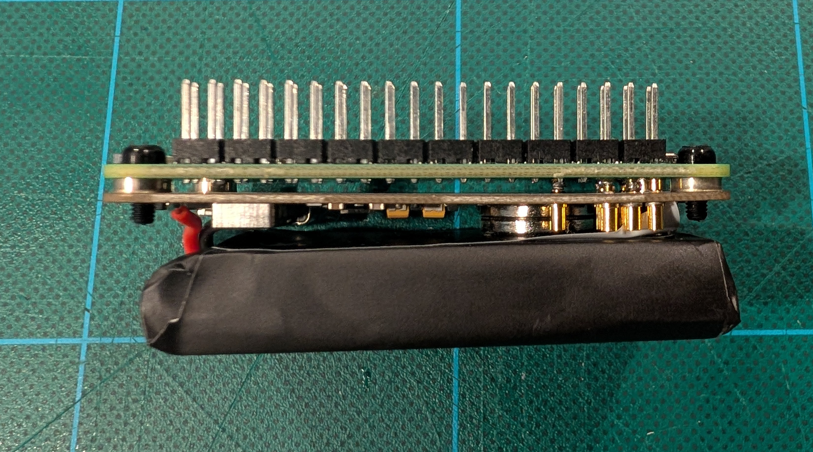
  - **⚠️ Warning:** Sometimes the golden pins on the **PiSugar 3** don't make enough contact to the **Raspberry Pi** and won't power up the unit. This is where the soldering comes in. You may need to apply a little bit of solder to the corresponding GPIO pins on the backside of the **Raspberry Pi**
  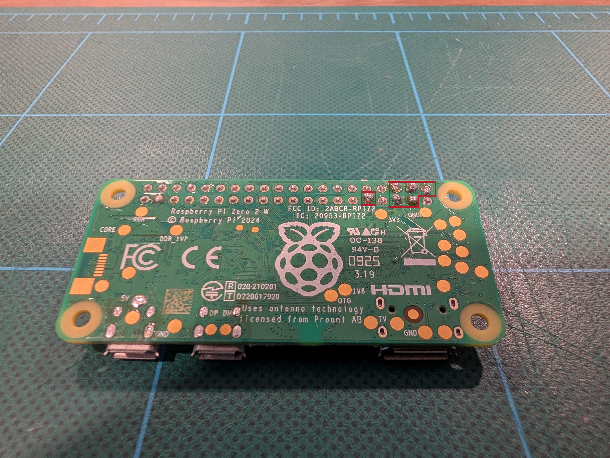
- Now you can connect the **Waveshare V4**, just line it up with the GPIO pins and press down.
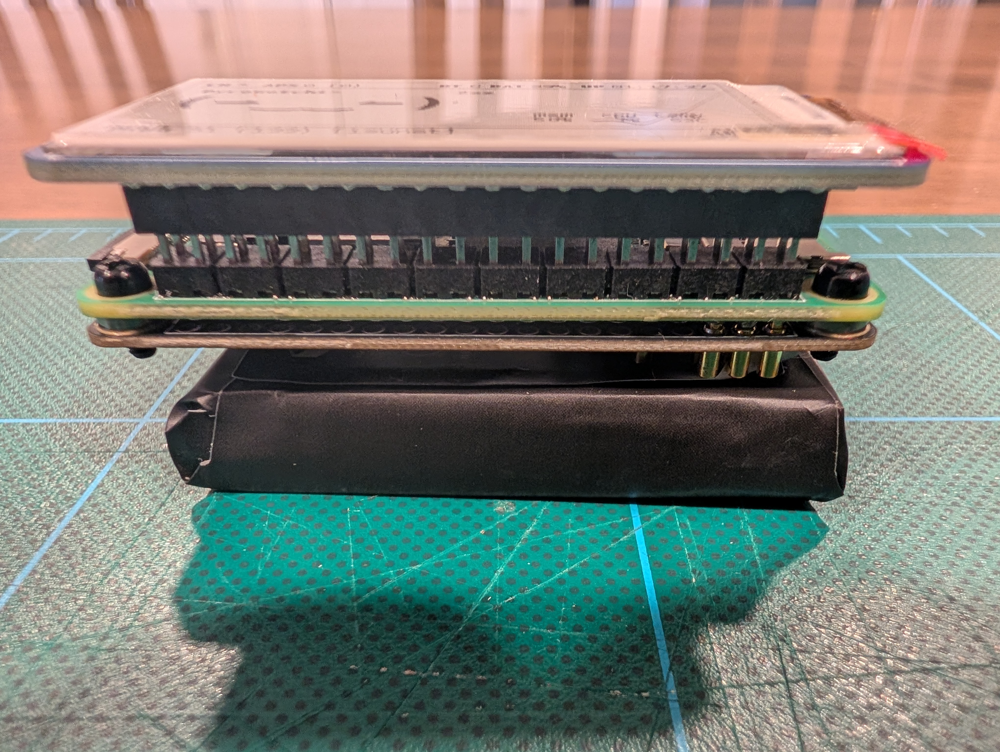

## Flashing the Image
---
- If you're using a Raspberry Pi 0W use the 32-bit image and if you are using a Raspberry Pi 02W, use the 64-bit image of [jayofelony/pwnagotchi](https://github.com/jayofelony/pwnagotchi/releases/latest)
- Once you have your image downloaded, use the [Raspberry Pi Imager](https://www.raspberrypi.com/software/) to flash the software.
  - On the left hand side select **OS** and then scroll down to the bottom and select **Use custom**. This will pop-up a window for you to select your downloaded image.
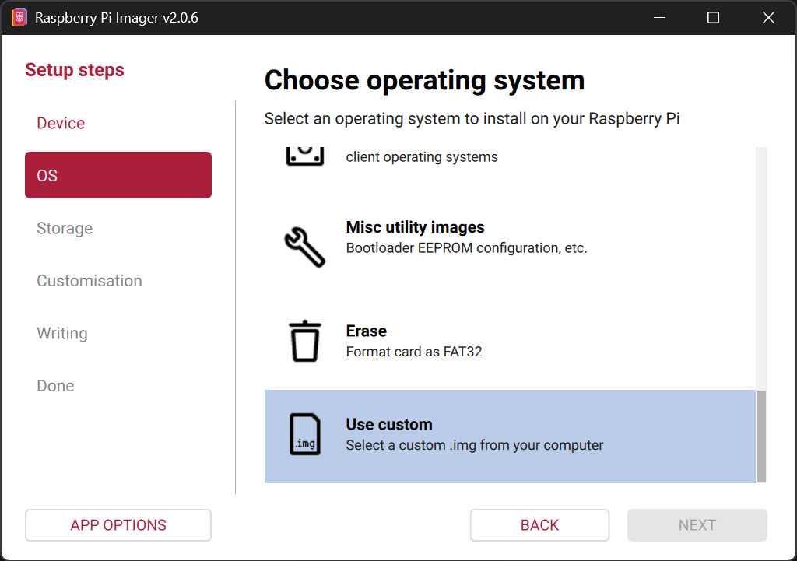
  - Once you have your image selected, click **NEXT**
  - Choose your microSDHC card for the storage device and click **NEXT**
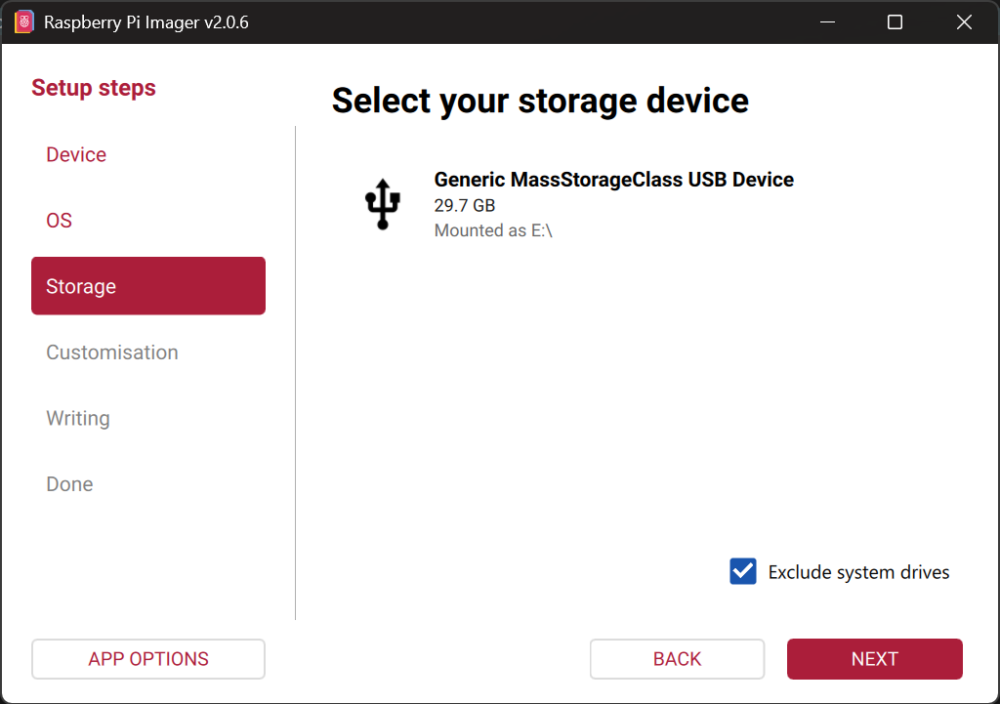
  - Click the **WRITE** button
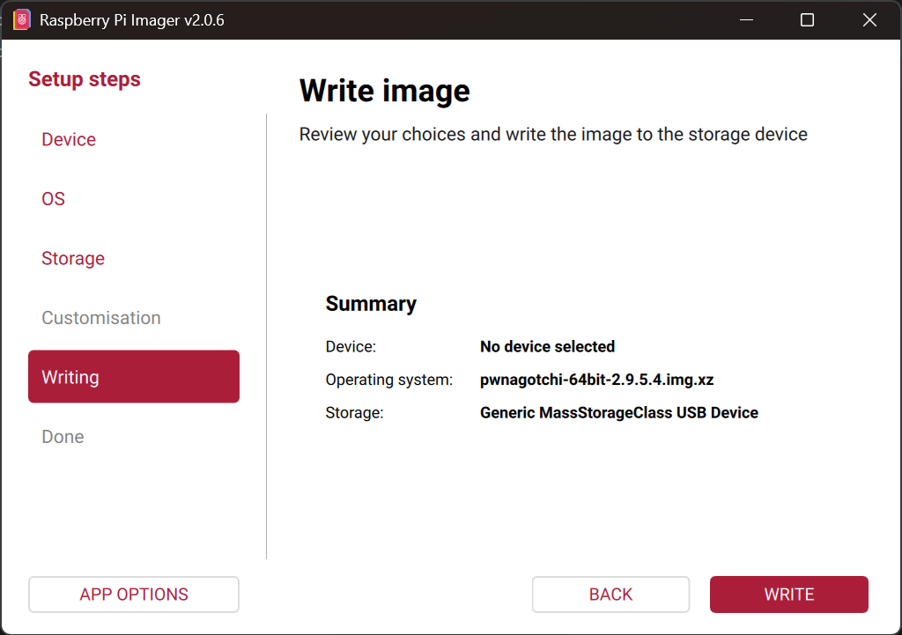
  - Click the **I UNDERSTAND, ERASE AND WRITE** button
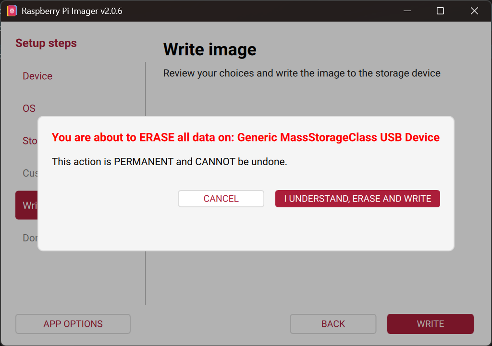
  - Click the **FINISH** button and then safely eject your microSDHC card
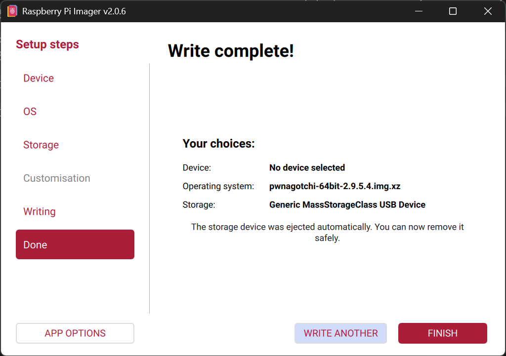

## Linux Setup
---
As of this writing, I am using Linux Mint. While in theory, you should just be able to plug in your data cable to connect to the Pwnagotchi, I could not reliably recreate the connection steps. I'm not saying you can't set up the Pwnagotchi using Linux natively, but to save yourself a potential headache, I highly recommend doing the initial connection and configuration on a Windows machine. Windows has just worked every time for me with zero issues.

## Windows Setup
---
### Install RNDIS Driver
- Before connecting the Pwnagotchi to your computer, you need to install the [RNDIS driver](https://github.com/jayofelony/pwnagotchi/wiki/rpi-usb-gadget-driver-setup.exe) in order for Windows to recognize your Pwnagotchi as a valid network device. Once installed, RNDIS creates a virtual network card that lets your computer treat the USB cable exactly like an Ethernet cable.

### Preparation
---
- Open Device Manager and Network Connections, this will make it easier to know when the Pwnagotchi has connected to our computer and is ready to communicate.
- Plug the USB-A to Micro USB data cable into the micro usb port closest to the HDMI port. Once you do this you will see in your Device Manager, **Unknown USB Device (Device Descriptor Request Failed)** under Universal Serial Bus controllers.
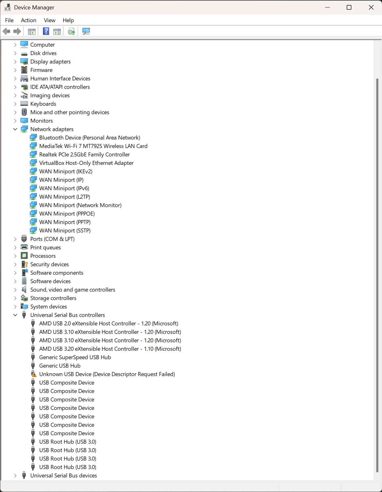
- **⚠️ CRITICAL STEP:** Leave the Pwnagotchi alone for 10 minutes. It's going to look like nothing is happening, and the Waveshare screen may flash and restart, but the Pwnagotchi takes awhile for it to initially setup and connect to the computer. I'm not joking, go get a drink, browse your phone, whatever just leave the Pwnagotchi alone.
  - During this time, the Pwnagotchi is generating its RSA cryptographic keys. This requires 'entropy' (randomness), and since the Pi Zero is small, it takes a while to gather enough random data to create secure keys. If you unplug it now, you might end up with half-generated keys or a corrupted file system.
- Once the Pwnagotchi is done setting up, the **Unknown USB Device (Device Descriptor Request Failed)** under Universal Serial Bus controllers will disappear and you should then see a new **Raspberry Pi USB Remote NDIS Network Device** under Network adapters.
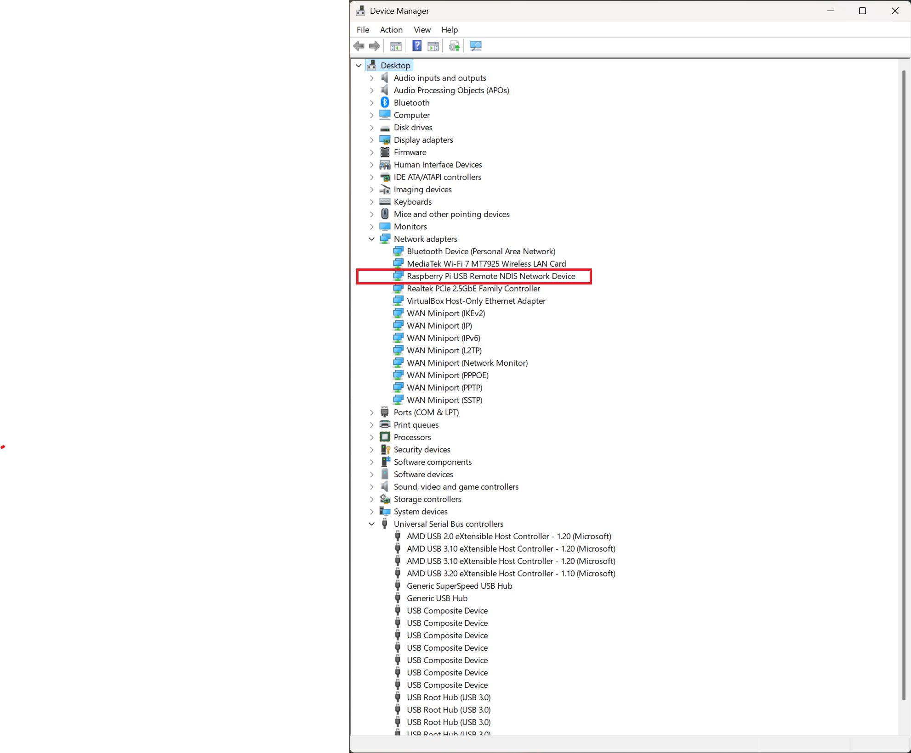
- You should also see a new network connection.
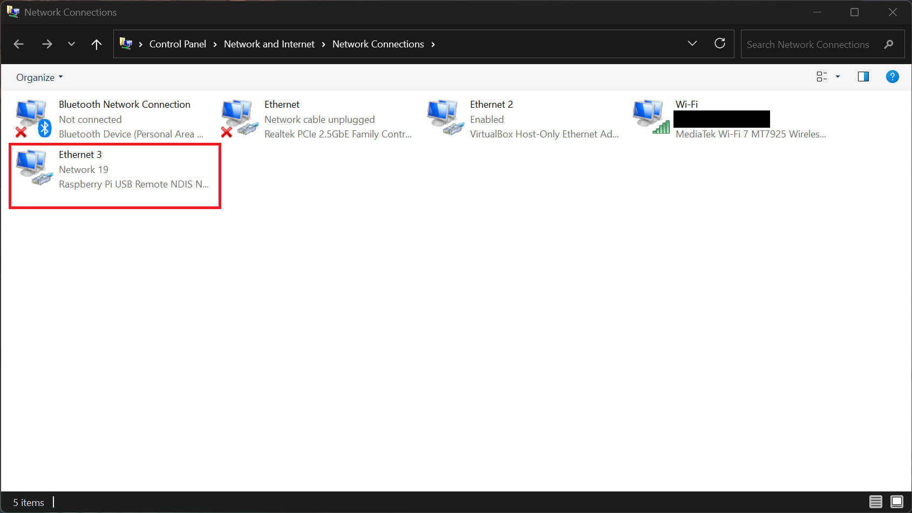

## Configuring the Pwnagotchi
---
- Configuration of the Pwnagotchi is the same whether you're using Linux or Windows, since we will be doing everything through SSH.
- Using your preferred terminal, type `ssh pi@pwnagotchi.local`
  - Confirm the security message by typing `yes`, and then enter the default password `raspberry`
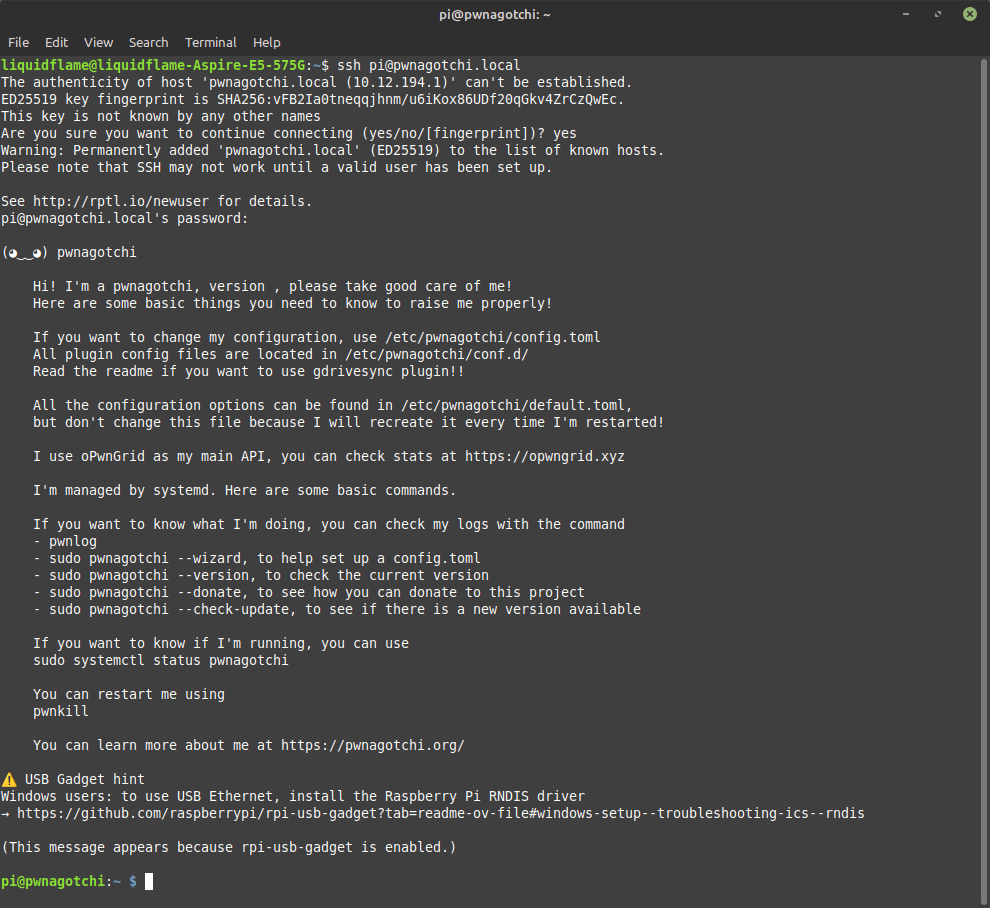
- Now you should be connected to the Pwnagotchi and can run the wizard by running `sudo pwnagotchi --wizard`
  - Follow the wizard prompts, they're pretty self-explanatory.
- When you're finished with the wizard, you should now be able to access your Pwnagotchi with the name you gave it through a browser (e.g., `liquidflame.local:8080`) or via SSH (e.g., `ssh pi@liquidflame.local`). 
- Once you're all done, you can shut it down safely by typing `sudo shutdown now` or by clicking on the Shutdown button in the browser. Unplug it, turn it back on, and start exploring!

# Extracting the Loot
---
So your Pwnagotchi has been out for a walk, and it has successfully captured some handshakes. Now what? Right now, those handshakes are just sitting on the microSD card doing absolutely nothing. We need to extract them. The Pwnagotchi saves these captures as `.pcap` (Packet Capture) files. Here is how to get them off the device and onto your main computer:

We can use **Secure Copy Protocol (SCP)** from our computer's terminal to retrieve the handshakes. Use the following command to copy the handshake files `scp pi@YOUR_PI_NAME:/home/pi/*.pcap ~/DESTINATION_TO_COPY_DATA/`

# What's Next?
Congratulations, you now possess the encrypted handshakes. In my next post, I will show you how to take these `.pcap` files, convert them into a crackable hash format, and feed them to Hashcat. We'll fire up a high-end GPU and see exactly how fast a dictionary attack can chew through a weak password!

# Resources
---
* [https://pwnagotchi.org/](https://pwnagotchi.org/)
* [https://github.com/jayofelony/pwnagotchi/wiki](https://github.com/jayofelony/pwnagotchi/wiki)
* [Discord](https://discord.gg/PGgnzFbz4M)
* [Reddit](https://www.reddit.com/r/pwnagotchi/)
* [Unofficial Plugin Registry](https://pwnstore.org/)
* [3D Printed Case I Use](https://makerworld.com/en/models/421353-pwn-in-place-pwnagotchi-case?from=search#profileId-1190179)
